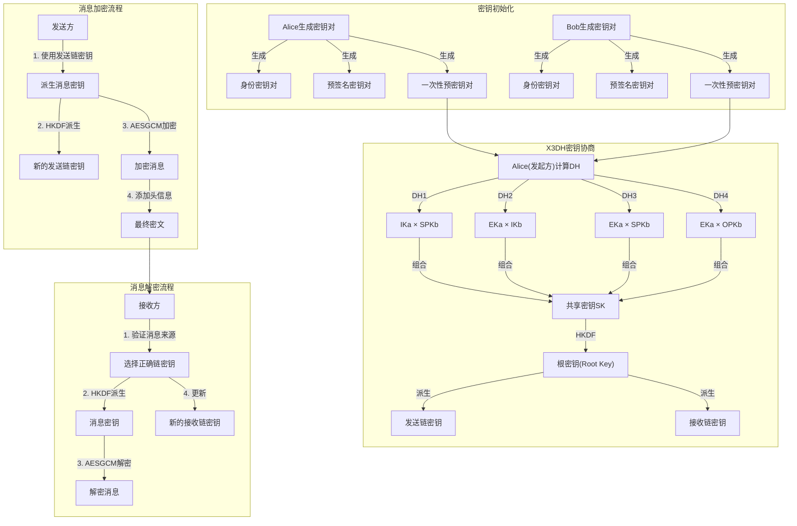
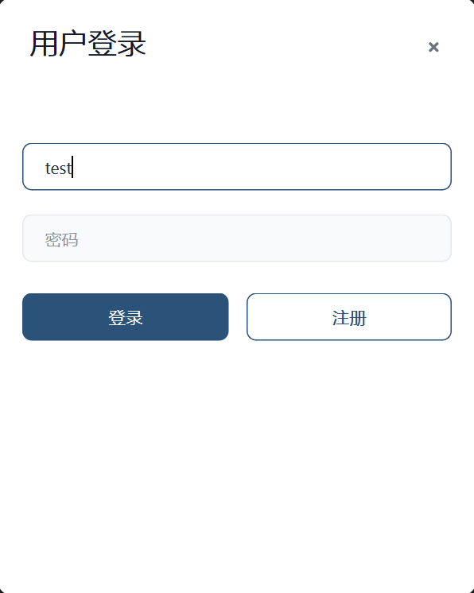
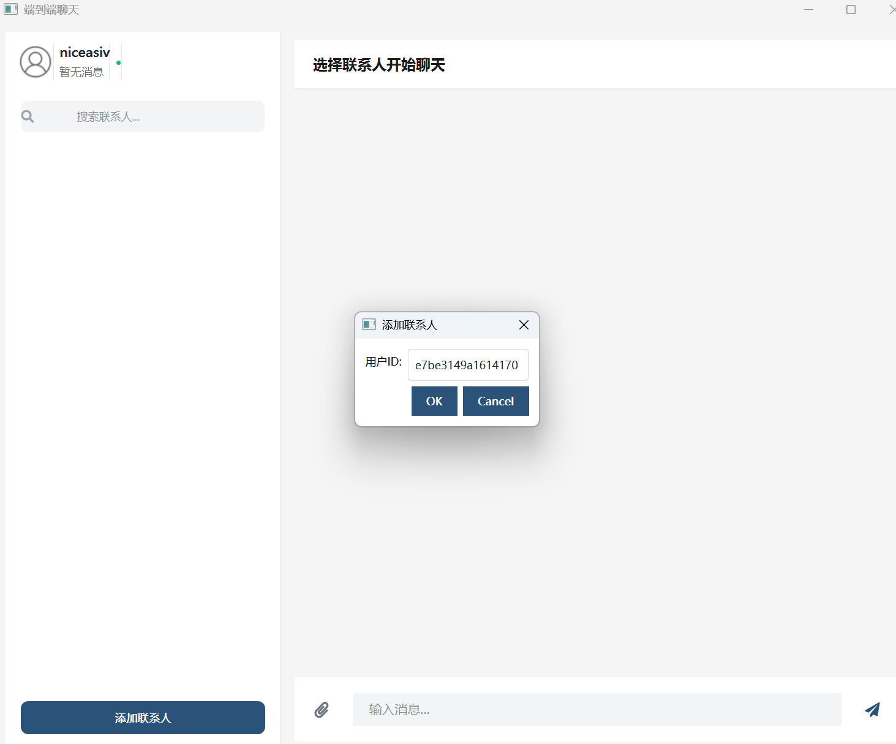
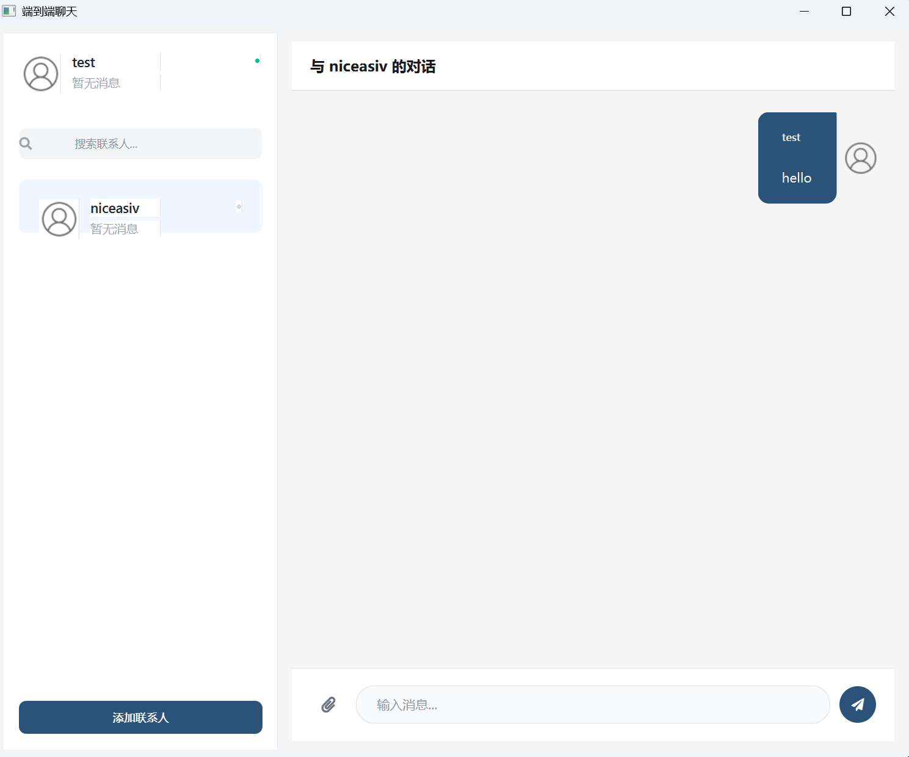
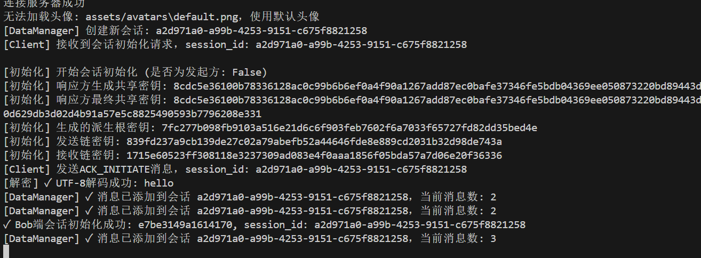
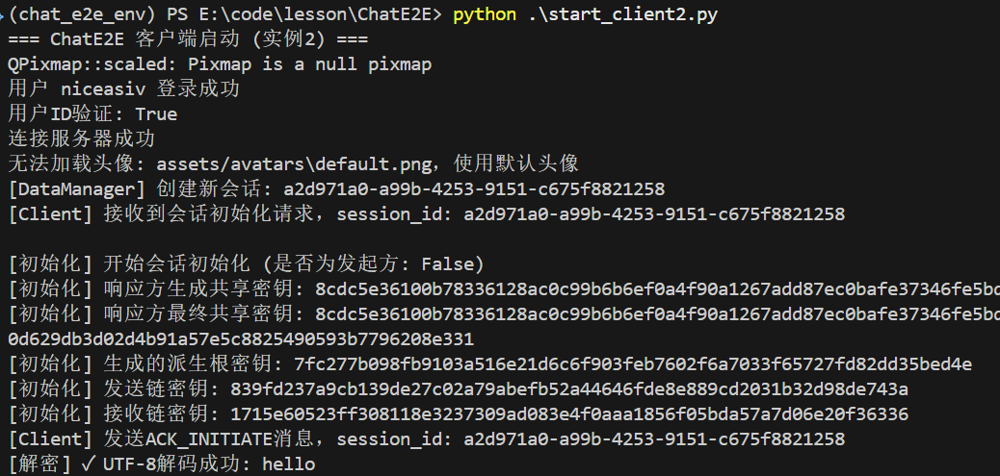

# ChatE2E - 基于Signal协议的端到端加密聊天应用

中文版 | [English](./README.md)

ChatE2E 是一个基于 Python 开发的端到端加密（End-to-End Encryption, E2EE）即时通讯应用。它实现了类 Signal 协议的安全通信机制，确保消息只能被发送者和接收者解密,服务器无法获取消息内容。


## 核心技术与原理

本项目主要包含以下核心技术组件：

### 1. 端到端加密 (Signal Protocol 实现)
核心安全机制基于 Signal Protocol 的变体，实现了前向安全（Forward Secrecy）和后向安全（Post-Compromise Security）。
*   **X3DH (Extended Triple Diffie-Hellman)**: 用于初始密钥协商。当两个用户首次建立会话时，通过服务器交换预密钥（Identity Key, Signed PreKey, One-Time PreKey）来协商出共享密钥，确保异步通信的安全性。
*   **Double Ratchet Algorithm (双棘轮算法)**: 用于会话过程中的密钥更新。
    *   **Diffie-Hellman 棘轮**: 随着消息交换不断更新共享密钥，提供前向安全。
    *   **KDF 链 (哈希) 棘轮**: 为每条消息生成独立的加密密钥。
*   **加密原语**:
    *   **X25519**: 椭圆曲线 Diffie-Hellman 密钥交换。
    *   **AES-GCM**: 关联数据的认证加密。
    *   **HMAC-SHA256 / HKDF**: 密钥派生函数。

### 2. 通信架构
*   **Client-Server 模型**: 服务器仅作为消息中转站（Relay）和密钥存储中心（Key Store）。
*   **WebSocket (Socket.IO)**: 用于实时的消息推送、好友状态更新和信令交换。
*   **REST API (Flask)**: 用于用户注册、密钥包（Bundle）上传与获取、离线消息拉取等。

### 3. 客户端界面
*   **PyQt6**: 使用 Python 的 Qt 绑定库构建跨平台桌面 GUI。
*   **本地存储**: 用户密钥、会话状态和聊天记录加密存储在本地 JSON 文件中。

## 环境安装

### 前置要求
*   Python 3.8 或更高版本

### 安装步骤

1.  克隆仓库：
    ```bash
    git clone https://github.com/NiceAsiv/ChatE2E.git
    cd ChatE2E
    ```

2.  创建并激活虚拟环境（推荐）：
    ```bash
    # 使用 Conda
    conda env create -f conda_env.yaml
    conda activate chat_e2e_env
    
    # 或者使用 venv
    python -m venv venv
    # Windows
    .\venv\Scripts\activate
    # Linux/Mac
    source venv/bin/activate
    ```

3.  安装依赖：
    ```bash
    pip install -r requirements.txt
    ```

## 使用指南

本项目包含服务器端和客户端启动脚本，支持在同一台机器上模拟多用户通信。

### 1. 启动服务器
首先启动中央服务器，用于处理信令交换和消息转发。
```bash
python start_server.py
```
*   务器默认运行在 `http://localhost:5000`。

### 2. 启动客户端
你可以启动多个客户端实例来模拟不同的用户。

**启动第一个客户端 (Alice):**

```bash
python start_client.py
```



**启动第二个客户端 (Bob):**

```bash
python start_client2.py
```

### 3. 聊天流程
1. **注册/登录**: 在客户端登录界面输入用户名（例如 "Alice" 或 "Bob"）。如果是首次登录，系统会自动注册并生成加密密钥对。下面我们注册了
   账号：test

   密码：123456

   ```json
   {
     "user_id": "e7be3149a1614170",
     "username": "test",
     "avatar_path": "assets/avatars\\default.png",
     "status": "offline",
     "last_seen": "2025-12-13T08:48:48.947842+00:00",
     "password_hash": "jOW/DBLv9KzEOB9jiy74i6egbUGTIAPyV/dkx5IUc60=",
     "salt": "faQh1etsHfWvuZO+iuPPsw==",
     "bundle": {
       "identity_key_pub": "G+mYjBFpIXI6wWxMGWN90OOJXOxLwDXAGMIJd3diSmk=",
       "signed_pre_key_pub": "vj5UITryFzcV+4Om3MXS0gFJs852LMpEZrMd4rhu0Qo=",
       "signed_pre_key_signature": "KgYZ7ue/nHQfIZuHrqL8dcS/7kv0gqeE+8aNpC3VNs4=",
       "one_time_pre_keys_pub": [
         "ZYIA8Sx38/DeIESENuL3tZwglYHVMgDO3Cv9DOdCp3U=",
         "jiMqTO7VAKHN/D4uQvCidv4/BZVDcfsEkJWn8jVyQi8=",
         "BNucY7d4LeC7PlhLvmS5obbq54dlphgJtMDN5hOlbws=",
         "KzDr5L308u3WkKBX89yn3FlI1VnCCmT/tdNM+s6BEG0=",
         "ZCEn1qqSYBo2eQmKijKdLqnd2K6X0yP4SRLEu22xJnY=",
         "qaT9wzqJcLOGy+1TUKgnPGmEOe4zwh+2yXHQmJoDkw8=",
         "cmN6CS3RHw1R+L0qaFTIQbbV/enLB7i6vieTBgEXagQ=",
         "SShCloFXDmuAOfK0ecqN4FEe22zkJnBqIwbstoCmfE0=",
         "W4gCafsvi3ZoSmEz6qHTTPKbbCtc5+h2VEcq0nmxb30=",
         "nTMv+nkrfU76S9ym71MtGclWse0Ya9+fgLYqKNb6yS8="
       ]
     },
     "localBundle": {
       "identity_key_pair": {
         "private_key": "wLzArjb/k98rK+8HGCeBehQujYpLICrJN/wdsmK4g1Q=",
         "public_key": "G+mYjBFpIXI6wWxMGWN90OOJXOxLwDXAGMIJd3diSmk="
       },
       "signed_pre_key_pair": {
         "private_key": "iPZ8OvbTNghtTGzp85RlMVFXXmb+ZPXm8t3oAHraUkM=",
         "public_key": "vj5UITryFzcV+4Om3MXS0gFJs852LMpEZrMd4rhu0Qo="
       },
       "signed_pre_key_signature": "KgYZ7ue/nHQfIZuHrqL8dcS/7kv0gqeE+8aNpC3VNs4=",
       "one_time_pre_key_pairs": [
         {
           "private_key": "0C3oMHwnnVL7eXEQ9cUp/5LhMy74Nnpy7fz15JbtNWs=",
           "public_key": "ZYIA8Sx38/DeIESENuL3tZwglYHVMgDO3Cv9DOdCp3U="
         },
         {
           "private_key": "kCX7IKTKteUpAmLiZ5WWh2RCXa1SW7AOGjDhQZg5n10=",
           "public_key": "ZCEn1qqSYBo2eQmKijKdLqnd2K6X0yP4SRLEu22xJnY="
         },
         {
           "private_key": "wB0RAdNl2SBqKmgpJnvAnII03k953nZNBY18zpjQiE0=",
           "public_key": "KzDr5L308u3WkKBX89yn3FlI1VnCCmT/tdNM+s6BEG0="
         },
         {
           "private_key": "UHW/CapBgjhVm9EOYkxUvjw8GksEQfPxdrR5QZcTS1Q=",
           "public_key": "cmN6CS3RHw1R+L0qaFTIQbbV/enLB7i6vieTBgEXagQ="
         },
         {
           "private_key": "kJctVVsMO3+kRwN8+JMnKn6tGeiC1BkFUJV13tiO0HE=",
           "public_key": "BNucY7d4LeC7PlhLvmS5obbq54dlphgJtMDN5hOlbws="
         },
         {
           "private_key": "yHH0m6DNkm3ReoYlGDN8g2UO0wVBmu299ISTXhxOh00=",
           "public_key": "qaT9wzqJcLOGy+1TUKgnPGmEOe4zwh+2yXHQmJoDkw8="
         },
         {
           "private_key": "4DVKNEdO9s6IQtE5Pam6pDzQahZVNAcC1hyWAgDOu1c=",
           "public_key": "W4gCafsvi3ZoSmEz6qHTTPKbbCtc5+h2VEcq0nmxb30="
         },
         {
           "private_key": "8N9wx8Ny4C+NrCFMwTBLKiN6aCcv3d20Xnx1fTnXyHI=",
           "public_key": "nTMv+nkrfU76S9ym71MtGclWse0Ya9+fgLYqKNb6yS8="
         },
         {
           "private_key": "6MXQwuem3t9cx+LD5rFUZQG9S5g4wWA3ThWN1o6/WFE=",
           "public_key": "jiMqTO7VAKHN/D4uQvCidv4/BZVDcfsEkJWn8jVyQi8="
         },
         {
           "private_key": "sHJmmTQG/OMsBT7qzULhrQKSyECzvVXl+FSeGTlJYEo=",
           "public_key": "SShCloFXDmuAOfK0ecqN4FEe22zkJnBqIwbstoCmfE0="
         }
       ]
     },
     "friends": []
   }
   ```

2. **添加好友**:

   * 在客户端 A 中点击"添加好友"。

     

   * 输入客户端 B 的 **用户ID** (User UUID)。

   * *提示：用户ID可以在登录成功后的控制台日志中看到，或者在代码调试中获取。实际应用中通常通过用户名搜索，本项目简化为通过ID添加。*

   *   (注：当前版本实现了自动同意好友请求逻辑)。

3. **发送消息**:
   * 在左侧联系人列表中选择好友。

     

     发送的消息：

     

     接收的消息

     

     

   * 输入消息并发送。

   *   观察控制台日志，可以看到密钥协商（X3DH）和消息加密/解密的过程。

## 项目结构

*   `chate2e/`: 核心源码包
    *   `client/`: 客户端逻辑 (UI, 网络通信, 业务逻辑)
    *   `server/`: 服务器逻辑 (Flask App, SocketIO 处理)
    *   `crypto/`: 加密模块 (Signal 协议实现, 密码学原语封装)
    *   `model/`: 数据模型 (消息, 用户, 密钥包)
*   `chat_data/`: 客户端本地数据存储目录 (自动生成)
*   `start_server.py`: 服务器启动脚本
*   `start_client.py`: 客户端启动脚本

## 许可证

MIT License
