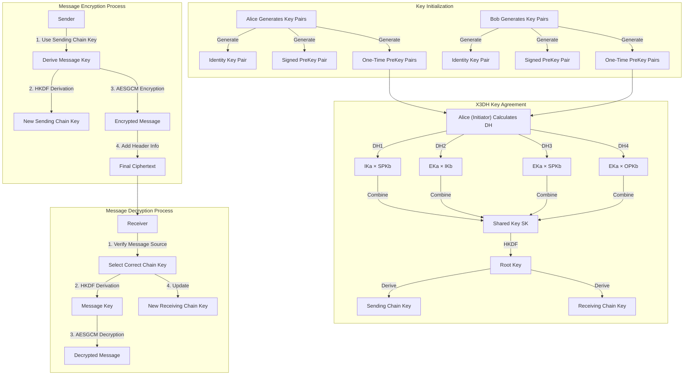

# ChatE2E - End-to-End Encrypted Chat Application Based on Signal Protocol

[中文版](./README-zh.md) | English

ChatE2E is an end-to-end encrypted (E2EE) instant messaging application developed with Python. It implements a Signal Protocol-like secure communication mechanism, ensuring that messages can only be decrypted by the sender and receiver, with the server unable to access message content.


## Core Technologies and Principles

This project includes the following core technical components:

### 1. End-to-End Encryption (Signal Protocol Implementation)
The core security mechanism is based on a variant of the Signal Protocol, implementing Forward Secrecy and Post-Compromise Security.
*   **X3DH (Extended Triple Diffie-Hellman)**: Used for initial key agreement. When two users first establish a session, they exchange pre-keys (Identity Key, Signed PreKey, One-Time PreKey) through the server to negotiate a shared key, ensuring asynchronous communication security.
*   **Double Ratchet Algorithm**: Used for key updates during sessions.
    *   **Diffie-Hellman Ratchet**: Continuously updates the shared key with message exchanges, providing forward secrecy.
    *   **KDF Chain (Hash) Ratchet**: Generates independent encryption keys for each message.
*   **Cryptographic Primitives**:
    *   **X25519**: Elliptic curve Diffie-Hellman key exchange.
    *   **AES-GCM**: Authenticated encryption with associated data.
    *   **HMAC-SHA256 / HKDF**: Key derivation functions.

### 2. Communication Architecture
*   **Client-Server Model**: The server only serves as a message relay and key storage center.
*   **WebSocket (Socket.IO)**: Used for real-time message push, friend status updates, and signaling exchange.
*   **REST API (Flask)**: Used for user registration, bundle upload and retrieval, offline message pulling, etc.

### 3. Client Interface
*   **PyQt6**: Cross-platform desktop GUI built using Python's Qt binding library.
*   **Local Storage**: User keys, session states, and chat history are encrypted and stored in local JSON files.

## Installation

### Prerequisites
*   Python 3.8 or higher

### Installation Steps

1.  Clone the repository:
    ```bash
    git clone https://github.com/NiceAsiv/ChatE2E.git
    cd ChatE2E
    ```

2.  Create and activate a virtual environment (recommended):
    ```bash
    # Using Conda
    conda env create -f conda_env.yaml
    conda activate chat_e2e_env
    
    # Or using venv
    python -m venv venv
    # Windows
    .\venv\Scripts\activate
    # Linux/Mac
    source venv/bin/activate
    ```

3.  Install dependencies:
    ```bash
    pip install -r requirements.txt
    ```

## Usage Guide

This project includes server-side and client-side startup scripts, supporting multi-user communication simulation on the same machine.

### 1. Start the Server
First, start the central server to handle signaling exchange and message forwarding.
```bash
python start_server.py
```
*   The server runs by default on `http://localhost:5000`.

### 2. Start the Client
You can start multiple client instances to simulate different users.

**Start the first client (Alice):**

```bash
python start_client.py
```


**Start the second client (Bob):**

```bash
python start_client2.py
```

### 3. Chat Flow
1. **Register/Login**: Enter a username (e.g., "Alice" or "Bob") in the client login interface. If it's the first login, the system will automatically register and generate encryption key pairs. Below is an example of a registered account:
   
   Username: test

   Password: 123456

   ```json
   {
     "user_id": "e7be3149a1614170",
     "username": "test",
     "avatar_path": "assets/avatars\\default.png",
     "status": "offline",
     "last_seen": "2025-12-13T08:48:48.947842+00:00",
     "password_hash": "jOW/DBLv9KzEOB9jiy74i6egbUGTIAPyV/dkx5IUc60=",
     "salt": "faQh1etsHfWvuZO+iuPPsw==",
     "bundle": {
       "identity_key_pub": "G+mYjBFpIXI6wWxMGWN90OOJXOxLwDXAGMIJd3diSmk=",
       "signed_pre_key_pub": "vj5UITryFzcV+4Om3MXS0gFJs852LMpEZrMd4rhu0Qo=",
       "signed_pre_key_signature": "KgYZ7ue/nHQfIZuHrqL8dcS/7kv0gqeE+8aNpC3VNs4=",
       "one_time_pre_keys_pub": [
         "ZYIA8Sx38/DeIESENuL3tZwglYHVMgDO3Cv9DOdCp3U=",
         "jiMqTO7VAKHN/D4uQvCidv4/BZVDcfsEkJWn8jVyQi8=",
         "BNucY7d4LeC7PlhLvmS5obbq54dlphgJtMDN5hOlbws=",
         "KzDr5L308u3WkKBX89yn3FlI1VnCCmT/tdNM+s6BEG0=",
         "ZCEn1qqSYBo2eQmKijKdLqnd2K6X0yP4SRLEu22xJnY=",
         "qaT9wzqJcLOGy+1TUKgnPGmEOe4zwh+2yXHQmJoDkw8=",
         "cmN6CS3RHw1R+L0qaFTIQbbV/enLB7i6vieTBgEXagQ=",
         "SShCloFXDmuAOfK0ecqN4FEe22zkJnBqIwbstoCmfE0=",
         "W4gCafsvi3ZoSmEz6qHTTPKbbCtc5+h2VEcq0nmxb30=",
         "nTMv+nkrfU76S9ym71MtGclWse0Ya9+fgLYqKNb6yS8="
       ]
     },
     "localBundle": {
       "identity_key_pair": {
         "private_key": "wLzArjb/k98rK+8HGCeBehQujYpLICrJN/wdsmK4g1Q=",
         "public_key": "G+mYjBFpIXI6wWxMGWN90OOJXOxLwDXAGMIJd3diSmk="
       },
       "signed_pre_key_pair": {
         "private_key": "iPZ8OvbTNghtTGzp85RlMVFXXmb+ZPXm8t3oAHraUkM=",
         "public_key": "vj5UITryFzcV+4Om3MXS0gFJs852LMpEZrMd4rhu0Qo="
       },
       "signed_pre_key_signature": "KgYZ7ue/nHQfIZuHrqL8dcS/7kv0gqeE+8aNpC3VNs4=",
       "one_time_pre_key_pairs": [
         {
           "private_key": "0C3oMHwnnVL7eXEQ9cUp/5LhMy74Nnpy7fz15JbtNWs=",
           "public_key": "ZYIA8Sx38/DeIESENuL3tZwglYHVMgDO3Cv9DOdCp3U="
         },
         {
           "private_key": "kCX7IKTKteUpAmLiZ5WWh2RCXa1SW7AOGjDhQZg5n10=",
           "public_key": "ZCEn1qqSYBo2eQmKijKdLqnd2K6X0yP4SRLEu22xJnY="
         },
         {
           "private_key": "wB0RAdNl2SBqKmgpJnvAnII03k953nZNBY18zpjQiE0=",
           "public_key": "KzDr5L308u3WkKBX89yn3FlI1VnCCmT/tdNM+s6BEG0="
         },
         {
           "private_key": "UHW/CapBgjhVm9EOYkxUvjw8GksEQfPxdrR5QZcTS1Q=",
           "public_key": "cmN6CS3RHw1R+L0qaFTIQbbV/enLB7i6vieTBgEXagQ="
         },
         {
           "private_key": "kJctVVsMO3+kRwN8+JMnKn6tGeiC1BkFUJV13tiO0HE=",
           "public_key": "BNucY7d4LeC7PlhLvmS5obbq54dlphgJtMDN5hOlbws="
         },
         {
           "private_key": "yHH0m6DNkm3ReoYlGDN8g2UO0wVBmu299ISTXhxOh00=",
           "public_key": "qaT9wzqJcLOGy+1TUKgnPGmEOe4zwh+2yXHQmJoDkw8="
         },
         {
           "private_key": "4DVKNEdO9s6IQtE5Pam6pDzQahZVNAcC1hyWAgDOu1c=",
           "public_key": "W4gCafsvi3ZoSmEz6qHTTPKbbCtc5+h2VEcq0nmxb30="
         },
         {
           "private_key": "8N9wx8Ny4C+NrCFMwTBLKiN6aCcv3d20Xnx1fTnXyHI=",
           "public_key": "nTMv+nkrfU76S9ym71MtGclWse0Ya9+fgLYqKNb6yS8="
         },
         {
           "private_key": "6MXQwuem3t9cx+LD5rFUZQG9S5g4wWA3ThWN1o6/WFE=",
           "public_key": "jiMqTO7VAKHN/D4uQvCidv4/BZVDcfsEkJWn8jVyQi8="
         },
         {
           "private_key": "sHJmmTQG/OMsBT7qzULhrQKSyECzvVXl+FSeGTlJYEo=",
           "public_key": "SShCloFXDmuAOfK0ecqN4FEe22zkJnBqIwbstoCmfE0="
         }
       ]
     },
     "friends": []
   }
   ```

2. **Add Friends**:

   * Click "Add Friend" in Client A.

     

   * Enter the **User ID** (User UUID) of Client B.

   * *Note: The user ID can be seen in the console log after successful login or obtained during code debugging. In real applications, users are typically searched by username; this project simplifies it by adding via ID.*

   *   (Note: The current version implements automatic friend request acceptance logic).

3. **Send Messages**:
   * Select a friend from the contact list on the left.

     

     Sent message:

     

     Received message:

     

     

   * Type a message and send it.

   *   Observe the console logs to see the key agreement (X3DH) and message encryption/decryption process.

## Project Structure

*   `chate2e/`: Core source package
    *   `client/`: Client logic (UI, network communication, business logic)
    *   `server/`: Server logic (Flask App, SocketIO handling)
    *   `crypto/`: Encryption module (Signal protocol implementation, cryptographic primitives wrapper)
    *   `model/`: Data models (messages, users, key bundles)
*   `chat_data/`: Client local data storage directory (auto-generated)
*   `start_server.py`: Server startup script
*   `start_client.py`: Client startup script

## License

MIT License
